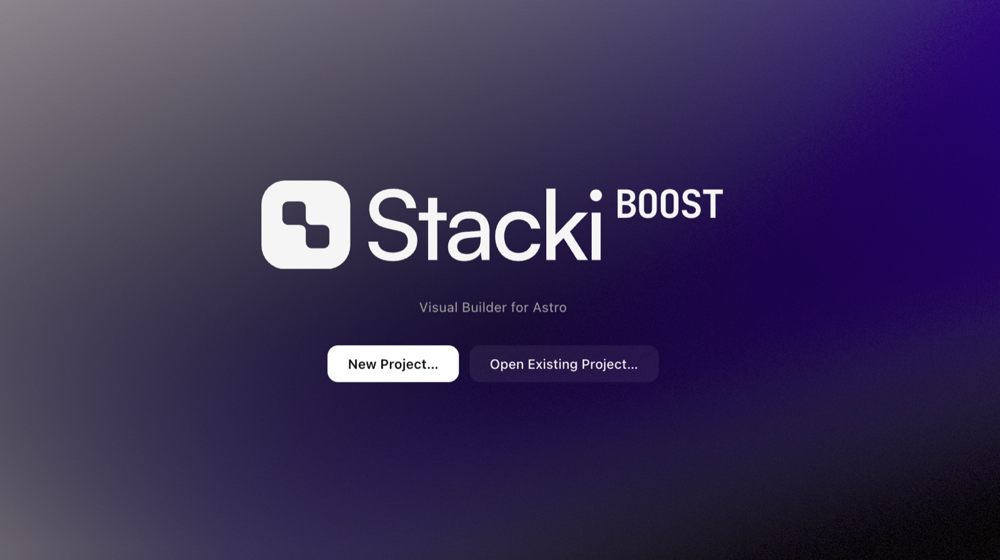

<p align="center">
  
</p>

# StackiBoost

Visual Builder for Astro — boosted with AI.

A fork of [Stacki](https://github.com/flowtricks/stacki) by Timothy Ricks that adds a built-in AI assistant powered by [Claude Code](https://claude.com/claude-code). Edit your Astro site visually, and when you want something bigger — a new section, a whole page, a restyle — just ask.

MIT licensed, like the original.

## The AI panel

- **✦ AI on the left rail** (or `⌘J`) opens a floating chat over the canvas. `Esc` closes it.
- **It knows what you're looking at.** The open page and the element you have selected on the canvas (breadcrumb, props, text) are sent along with every prompt — "make this heading bigger" just works.
- **Your own subscriptions, no API keys.** Prompts run through whichever coding CLI you have installed and logged into — [Claude Code](https://claude.com/claude-code) (claude.ai Pro/Max), [Codex CLI](https://developers.openai.com/codex/cli) (ChatGPT), or [Gemini CLI](https://github.com/google-gemini/gemini-cli) (Google). Switch models from the dropdown in the chat.
- **Edits show up live.** The AI edits the project files directly; Astro's hot reload and Stacki's file watcher update the canvas while it works.
- **Connected models** (gear on the left rail) shows which CLIs are installed and logged in, with one-click connection tests and install links.

To use it, install at least one of the CLIs above, log in once from a terminal, and you're set.

## Features

- **Pages** — browse every page in `src/pages`, create new pages (including nested routes like `blog/post-1`), and delete pages.
- **Layouts** — choose which layout from `src/layouts` wraps each page, and edit the layout's props (e.g. `title`).
- **Components** — every component in `src/components` appears in the palette. Drag one into the page structure (or double-click to append), drag to reorder, click ✕ to remove.
- **Props** — the props panel reads each component's `interface Props` / `Astro.props` destructure and generates typed fields (text, number, checkbox). Defaults are shown as placeholders.
- **Live preview** — the app runs `astro dev` for the opened project and embeds it. Edits are auto-saved (300 ms debounce), so Astro's hot reload updates the preview as you type.
- **Git & GitHub** — the branch chip in the title bar shows the current branch and dirty state. From its dropdown you can switch branches, create branches, commit, push, or publish a brand-new repo to GitHub (via the `gh` CLI).
- **Code fallback** — pages with markup too complex for the visual model open in a code editor instead, still with live preview.
- **New project** — "New Project…" scaffolds a minimal Astro starter (layout + 5 components + home page) and runs `npm install` for you.

## Running in development

```bash
npm install
npm run dev
```

`npm run dev` starts Vite (renderer hot reload) and launches Electron against it.

To run against a production build of the UI:

```bash
npm start
```

## Packaging installers

Use the unsigned build — it needs no Apple Developer account and no
certificates:

```bash
npm run dist:mac:unsigned   # .dmg + .zip, no signing (build on macOS)
npm run dist:win            # NSIS installer (build on Windows)
```

Output lands in `release/`. macOS will warn the first time you open an
unsigned build; right-click the app and choose Open to get past Gatekeeper.

For a quick local install on macOS without a dmg:

```bash
npm run build
npx electron-builder --mac dir -c.mac.forceCodeSigning=false -c.mac.notarize=false -c.mac.identity=null
cp -R release/mac-arm64/StackiBoost.app /Applications/
```

Note: unlike upstream Stacki, this fork does not auto-update — the updater
is disabled so your build never gets replaced by an upstream release.

## Requirements

- Node.js 18+ and npm (the app shells out to `npm install` / `astro dev` for opened projects)
- `git` for version control features
- [GitHub CLI](https://cli.github.com) (`gh`), authenticated via `gh auth login`, for "Publish to GitHub"
- For the AI panel (optional — everything else works without it): [Claude Code](https://claude.com/claude-code), [Codex CLI](https://developers.openai.com/codex/cli), or [Gemini CLI](https://github.com/google-gemini/gemini-cli), logged in

## How editing works

Pages are parsed into a simple model: optional layout wrapper + a flat list of
self-closing component instances with props. The editor writes that model back
as clean `.astro` source. Pages containing arbitrary HTML, expressions, or
nested children fall back to the built-in code editor — nothing is ever
rewritten destructively.

## Credits

Stacki is created by [Timothy Ricks](https://www.timothyricks.com). This fork
adds the AI layer on top — if you just want the visual editor, use the
[original](https://github.com/flowtricks/stacki).
